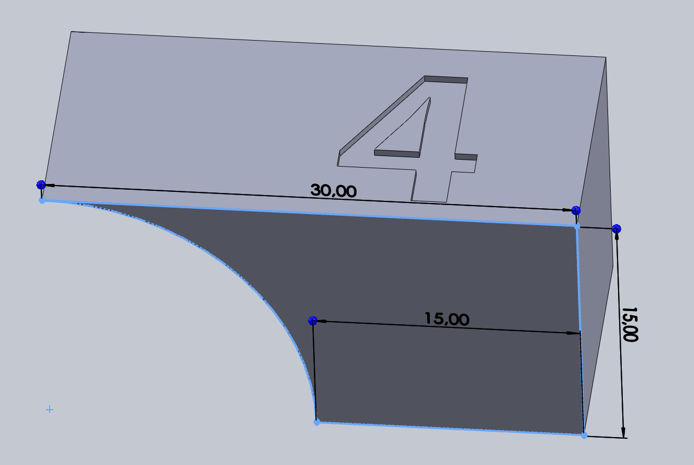

# My first time 3d printing

### About
In this project, I have explored low levels of 3D printing and make and test my own G-code on the Ender 3 (3dprinter). 
I also designed a simple cube in SolidWorks with overhang in solidworks, and experienced the need for support in certain situations.

### G-code

With G-code, I myself wrote one line that extrudes a 191mm long line with a height of 0.22mm.
After the line is printed, the code writes a bunch of small extrusions (100 lines per revolution) to make a helix with a layer height of 0.4mm. 
This helix also has a radius of 10mm. I did not write this code myself as it would have been a very repetitive and time consuming task, so I had help from GPT4, to create a python script that writes all the G-code for us. Both the python script and the G-code i used is in the `./output/` folder. Here is the resulting line and helix it printed:

### 3d modelling in SolidWorks
I made a 15mm x 30mm x 15mm cube in SolidWorks with one wall increasing in steepness from 90 degrees to 0 degrees as shown in the picture. I used Cura (3d printing program) with no support, and printed it out on the Ender to get an idea on how the printer handles steep overhangs. I made a 0.4mm engraved ASCII face on the top side of the cube. The SolidWorks model file of the cube is in the `./output/` folder, and here is a picture of the model loaded into Cura:

#### Conclusion: 
The 3d printer, with no problem, handles printing a gradually increasing steepnesses without support, however for sudden overhangs support should be used, or the overhang could be deformed or fall off.
